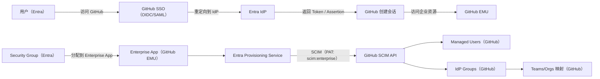

# GitHub Enterprise Managed Users（EMU）配置步骤（IdP = Microsoft Entra ID）

> 目标读者：负责落地 EMU 的操作者（GitHub 企业管理员 / Entra 管理员 / 安全与运维）。
>
> 参考资料（本文步骤以这些官方文档为准）：
> - GitHub：Getting started with Enterprise Managed Users
>   https://docs.github.com/en/enterprise-cloud@latest/admin/managing-iam/understanding-iam-for-enterprises/getting-started-with-enterprise-managed-users
> - GitHub：Configuring SCIM provisioning for users
>   https://docs.github.com/en/enterprise-cloud@latest/admin/managing-iam/provisioning-user-accounts-with-scim/configuring-scim-provisioning-for-users
> - Microsoft：Tutorial - configure GitHub Enterprise Managed User provisioning
>   https://learn.microsoft.com/en-us/entra/identity/saas-apps/github-enterprise-managed-user-provisioning-tutorial

---

## 0. 原理概览（Entra ID 如何与 GitHub EMU 打通）

**一句话总结**：
- **SSO（OIDC/SAML）**解决“**怎么登录**”（认证/条件访问）。
- **SCIM**解决“**账号与组怎么被创建/更新/禁用**”（生命周期与成员关系）。

### 0.1 关键组件

- **Microsoft Entra ID**：企业身份源（用户、Security Group、Conditional Access）。
- **GitHub Enterprise Managed Users (EMU)**：GitHub 侧账号体系（受 IdP 管控的 managed users）。
- **OIDC/SAML SSO**：用户访问 GitHub 时，GitHub 将认证委托给 Entra。
- **SCIM 2.0 + GitHub SCIM API**：Entra Provisioning Service 通过 SCIM API 在 GitHub 上创建/更新/禁用用户与组。
- **setup user + PAT（`scim:enterprise`）**：SCIM 调用凭据；Entra 在 Provisioning 配置中以 Secret Token 方式使用。

### 0.2 数据流（SSO + SCIM 同时生效）

**图中分两条链路：**

- **SSO 登录链路（上半部分）**：用户访问 GitHub 时，会被重定向到 Entra 进行认证；认证成功后 Entra 返回 OIDC Token 或 SAML Assertion，GitHub 建立会话后，用户才能访问 EMU 企业内资源。
- **SCIM 预配链路（下半部分）**：Entra 以“把用户/组分配到 Enterprise App”为范围，通过 Provisioning Service 调用 GitHub 的 SCIM API（使用 setup user 的 PAT，scope 为 `scim:enterprise`），在 GitHub 上创建/更新/禁用 **Managed Users**，并同步 **IdP Groups**，最终用于 Teams/Orgs 的映射与授权。

### 0.3 常见误区（务必避免）

- **只配了 SSO，但没配 SCIM**：用户能走 Entra 登录，但 GitHub 上不会自动创建/禁用 EMU 账号（也就谈不上授权）。
- **只配了 SCIM，但没配 SSO**：账号可能被创建，但用户无法按企业要求通过 IdP 认证访问 GitHub。
- **组用错类型/嵌套组**：Entra→GitHub 预配及 Team 映射通常要求 **Security Group**，且不支持 nested groups（按官方文档为准）。

---

## 1. 角色与分工（务必先对齐）

| 角色/人员 | 主要职责 |
|---|---|
| **GitHub 企业管理员（Enterprise Owner/管理员）** | 创建/接管 EMU 企业；使用 setup user 完成 GitHub 侧身份与预配配置；后续企业级策略配置 |
| **Entra 管理员（Cloud App Admin / App Admin / App Owner）** | 在 Entra 中创建/配置“GitHub Enterprise Managed User”企业应用；配置自动预配（Provisioning/SCIM）；分配用户/组 |
| **安全管理员** | 2FA、恢复码、PAT（SCIM Token）等敏感信息的保管与轮换；审批最小权限与上线窗口 |
| **运维/网络管理员（可选）** | 出站网络连通（Entra → GitHub SCIM API）、代理/防火墙放通、审计日志 |
| **项目负责人（可选）** | 推进跨团队协作、排期、灰度与验收 |

> 说明：文档中每一步都标注“**操作人**”。若贵司角色名称不同，可按职责映射。

---

## 2. 开始前准备（Checklist）

**操作人：项目负责人 + GitHub 企业管理员 + Entra 管理员 + 安全管理员**

- [ ] 确认本次要启用的是 **Enterprise Managed Users**（不是普通 Enterprise/Org 的 SSO）。
- [ ] 确认企业托管位置：**GitHub.com** 还是 **GHE.com（数据驻留/自定义子域）**（会影响 SCIM Tenant URL）。
- [ ] 准备密码管理器/密钥管理系统，用于保存：setup user 凭据、2FA 恢复码、SCIM Token（PAT）。
- [ ] 规划灰度范围：先用 1-2 个测试用户/组验证预配与登录，再扩大。

---

## 3. 配置步骤（按顺序执行）

### Step 1：创建 EMU 企业账号（GitHub 侧）

**操作人：GitHub 企业管理员**

1. 按 GitHub 官方指引创建启用 EMU 的企业账号（需要“单独类型的 enterprise account”）。
2. 记录企业的关键信息（用于后续配置）：
   - 企业名/Shortcode（后续会生成 `SHORTCODE_admin` setup user）
   - 企业访问入口（GitHub.com 或 GHE.com 子域）

参考：GitHub「Getting started with Enterprise Managed Users」
https://docs.github.com/en/enterprise-cloud@latest/admin/managing-iam/understanding-iam-for-enterprises/getting-started-with-enterprise-managed-users

---

### Step 2：初始化 setup user（`SHORTCODE_admin`）并启用 2FA

**操作人：GitHub 企业管理员（建议在安全管理员见证下操作）**

> setup user 用于**配置认证与预配**；后续建议仅用于：
> - SCIM 预配用的 PAT（Personal Access Token）
> - IdP 故障时使用 SSO recovery codes 恢复企业访问

1. 从 GitHub 发来的邀请邮件中，为 setup user 设置密码。
2. **使用隐身/无痕窗口**完成初始化（GitHub 文档建议）。
3. 为 setup user **启用 2FA** 并保存恢复码。
4. 将以下信息存入公司密码管理器（强制）：
   - setup user 用户名与密码
   - 2FA 方式与恢复码

参考：GitHub「Getting started with Enterprise Managed Users」
https://docs.github.com/en/enterprise-cloud@latest/admin/managing-iam/understanding-iam-for-enterprises/getting-started-with-enterprise-managed-users#create-the-setup-user

---

### Step 3：为 setup user 创建 SCIM Token（PAT classic）

**操作人：GitHub 企业管理员（安全管理员负责保管）**

1. 使用 setup user 登录 GitHub。
2. 创建 **Personal access token (classic)**：
   - **scope 至少包含 `scim:enterprise`**
   - **Token 不设置过期时间（no expiration）**
3. 将 Token 以“密钥/Secret”形式保存到密码管理器/密钥系统，命名建议：
   - `github-emu-scim-token-{enterprise}-{date}`

参考：GitHub「Getting started with Enterprise Managed Users」
https://docs.github.com/en/enterprise-cloud@latest/admin/managing-iam/understanding-iam-for-enterprises/getting-started-with-enterprise-managed-users#create-a-personal-access-token

---

### Step 4：配置认证（SSO）：Entra ID 作为 IdP

**操作人：GitHub 企业管理员 + Entra 管理员（OIDC 首次安装需要 Entra 全局管理员同意）**

GitHub 文档说明：当 IdP 为 Entra ID 时，可选择 **OIDC** 或 **SAML** 作为认证协议：
- GitHub 推荐 **OIDC**（支持 Conditional Access Policies）。
- **每个 Entra tenant 仅支持 1 个 EMU 的 OIDC 集成**；如需对接多个 EMU enterprises，请使用 SAML（以 GitHub 文档为准）。

#### 4.1 方案 A：OIDC（推荐，本文主线）

**操作人：GitHub 企业管理员 + Entra 管理员（需要 Entra 全局管理员完成一次 Consent）**

在 GitHub 侧（setup user 登录后）：
1. 进入 **Enterprise** → **Identity provider** → **Single sign-on configuration**。
2. 在 “OIDC single sign-on” 下选择 **Enable OIDC configuration**，然后 **Save**。
3. GitHub 会跳转到 Entra：由具备全局管理员权限的人员完成应用安装与授权，同意时勾选 **Consent on behalf of your organization**。
4. 回到 GitHub：保存/下载 SSO recovery codes（用于 IdP 不可用时恢复访问）。
5. 点击 **Enable OIDC Authentication** 完成启用。

#### 4.2 方案 B：SAML（仅在需要多企业对接同一 tenant 时使用）

**操作人：Entra 管理员（先配置 IdP 应用） + GitHub 企业管理员（setup user 登录后写入 GitHub）**

1. 在 Entra 中配置 GitHub EMU 的 SAML 应用并准备关键信息：
   - IdP Sign-On URL
   - Issuer
   - Signing certificate（Base64）
2. 在 GitHub 侧（setup user 登录后）进入 **Enterprise** → **Identity provider** → **Single sign-on configuration** → 添加 SAML 配置，并填写上述信息。
3. 保存/下载 SSO recovery codes。

验收点：
- [ ] 至少 1 个测试用户被分配到 IdP 应用，可完成一次成功登录（用于验证联通与配置）
- [ ] GitHub 企业侧显示 SSO 配置成功

参考：
- GitHub「Configuring OIDC for Enterprise Managed Users」
  https://docs.github.com/en/enterprise-cloud@latest/admin/identity-and-access-management/using-enterprise-managed-users-for-iam/configuring-oidc-for-enterprise-managed-users
- GitHub「Configuring SAML single sign-on for Enterprise Managed Users」
  https://docs.github.com/en/enterprise-cloud@latest/admin/identity-and-access-management/managing-iam-with-enterprise-managed-users/configuring-saml-single-sign-on-for-enterprise-managed-users

---

### Step 5：配置自动预配（SCIM）：Entra → GitHub EMU

**操作人：Entra 管理员（GitHub 企业管理员提供 Token/企业信息）**

> 这一段以 Microsoft 教程为准，核心是：在 Entra 企业应用里启用 Provisioning，并填写 Tenant URL + Secret Token。

#### 5.1 计算/确认 SCIM Tenant URL

**操作人：Entra 管理员（与 GitHub 企业管理员确认企业托管位置）**

Microsoft 文档给出的 Tenant URL 规则：
- 企业在 **GitHub.com**：
  - `https://api.github.com/scim/v2/enterprises/{enterprise}`
- 企业在 **GHE.com（数据驻留/子域）**：
  - `https://api.{subdomain}.ghe.com/scim/v2/enterprises/{subdomain}`

> `{enterprise}` / `{subdomain}` 使用你们实际的 enterprise 标识（与 GitHub 企业管理员确认）。

参考：Microsoft 教程 Step 2
https://learn.microsoft.com/en-us/entra/identity/saas-apps/github-enterprise-managed-user-provisioning-tutorial

#### 5.2 在 Entra 中添加企业应用（GitHub Enterprise Managed User）

**操作人：Entra 管理员**

1. 登录 Microsoft Entra admin center： https://entra.microsoft.com
2. 进入 **Entra ID** → **Enterprise apps**。
3. 从应用库添加/选择 **GitHub Enterprise Managed User**。

参考：Microsoft 教程 Step 3
https://learn.microsoft.com/en-us/entra/identity/saas-apps/github-enterprise-managed-user-provisioning-tutorial

#### 5.3 配置 Provisioning（Automatic）并测试连通

**操作人：Entra 管理员（安全管理员提供/审批密钥使用）**

1. 打开该企业应用的 **Provisioning** 页签。
2. 设置 **Provisioning Mode = Automatic**。
3. 在 **Admin Credentials** 中填写：
   - **Tenant URL**（上一步确定）
   - **Secret Token**（Step 3 创建的 `scim:enterprise` PAT）
4. 点击 **Test Connection** 验证连通性。
5. 配置失败告警邮件（Notification Email）。
6. **Save**。

参考：Microsoft 教程 Step 5（1-8）
https://learn.microsoft.com/en-us/entra/identity/saas-apps/github-enterprise-managed-user-provisioning-tutorial

#### 5.4（可选/建议）核对 Attribute Mappings

**操作人：Entra 管理员**

1. 在 **Mappings** 中检查：
   - Synchronize Microsoft Entra users → GitHub Enterprise Managed User
   - Synchronize Microsoft Entra groups → GitHub Enterprise Managed User
2. 若修改匹配属性（Matching），需确保 GitHub EMU SCIM API 支持对应过滤/匹配能力（按 Microsoft 教程提示）。

参考：Microsoft 教程 Step 5（9-12）
https://learn.microsoft.com/en-us/entra/identity/saas-apps/github-enterprise-managed-user-provisioning-tutorial

#### 5.5 选择预配范围（Scope）并启动 Provisioning

**操作人：Entra 管理员（项目负责人把关灰度范围）**

1. 在 Settings 中设置：
   - **Provisioning Status = On**
   - **Scope**：建议从 **Assigned users and groups** 小范围开始
2. 保存后，Entra 会开始首次同步。
   - 首次同步耗时更长
   - 后续大约每 40 分钟周期性同步（以 Microsoft 文档为准）

参考：Microsoft 教程 Step 5（14-16）
https://learn.microsoft.com/en-us/entra/identity/saas-apps/github-enterprise-managed-user-provisioning-tutorial

> 注意：Entra **不支持嵌套组（nested groups）预配**，请在分组策略上规避。

参考：GitHub「Configuring SCIM provisioning for users」末尾说明
https://docs.github.com/en/enterprise-cloud@latest/admin/managing-iam/provisioning-user-accounts-with-scim/configuring-scim-provisioning-for-users

---

### Step 6：分配用户/组到企业应用（决定“谁会被创建/禁用”）

**操作人：Entra 管理员（项目负责人确认范围）**

1. 将试点用户或试点组分配到该 Enterprise App。
2. 观察预配结果：
   - 成功：用户/组被创建并保持属性同步
   - 取消分配/停用：用户会在 GitHub 被禁用（并清理会话）

参考：GitHub「Configuring SCIM provisioning for users」-> About user lifecycle management with SCIM / Assigning users and groups
https://docs.github.com/en/enterprise-cloud@latest/admin/managing-iam/provisioning-user-accounts-with-scim/configuring-scim-provisioning-for-users#about-user-lifecycle-management-with-scim

---

### Step 7：GitHub 侧团队与 IdP 组同步（用于组织成员/授权管理）

**操作人：GitHub 企业管理员（Enterprise Owner）+ 组织管理员（Org Owner）+ Entra 管理员（管理组成员）**

前置要求（操作人：Entra 管理员）：
- 将目标 **Security Group** 分配到 GitHub Enterprise Managed User 企业应用（否则 GitHub 侧看不到可选组）。
- 注意：Entra 场景下仅支持 **Security Group**；不支持 nested group memberships / Microsoft 365 groups（以 GitHub 文档为准）。

在 GitHub 侧连接组与 Team（操作人：组织管理员/企业管理员）：
1. 在组织内创建新 Team，或进入已有 Team 的 Settings。
2. 在 **Identity Provider Group(s)** 中选择要连接的 IdP group，保存。
3. 之后 Team 成员以 IdP 组为准（在 GitHub 侧不能再直接管理成员）。

补充说明：
- IdP 组变更由 IdP 以其同步周期推送，可能不是实时；GitHub 也会每天做一次 reconciliation（以 GitHub 文档为准）。

参考：GitHub「Managing team memberships with identity provider groups」
https://docs.github.com/en/enterprise-cloud@latest/admin/identity-and-access-management/using-enterprise-managed-users-for-iam/managing-team-memberships-with-identity-provider-groups

---

## 4. 运行与监控（上线后必做）

### 4.1 监控预配健康度

**操作人：Entra 管理员**

- 使用 Entra 的 provisioning logs 排查失败/延迟
- 关注“quarantine”状态（预配异常时可能进入隔离）

参考：Microsoft 教程 Step 6
https://learn.microsoft.com/en-us/entra/identity/saas-apps/github-enterprise-managed-user-provisioning-tutorial

### 4.2 凭据与密钥管理

**操作人：安全管理员（GitHub 企业管理员配合）**

- setup user 凭据、2FA 恢复码、SCIM Token（PAT）应纳入公司密钥轮换与访问审计。
- 若需要重置 setup user 密码：按 GitHub 文档，需联系 GitHub Support（普通“忘记密码”流程无效）。

参考：GitHub「Getting started with Enterprise Managed Users」
https://docs.github.com/en/enterprise-cloud@latest/admin/managing-iam/understanding-iam-for-enterprises/getting-started-with-enterprise-managed-users#create-the-setup-user

---

## 5. 最小验收清单（建议在灰度完成后签字）

**操作人：项目负责人（组织验收），GitHub 企业管理员 + Entra 管理员（提供证据）**

- [ ] 试点用户可通过 SSO 登录 GitHub（OIDC/SAML 之一）
- [ ] Entra → GitHub 的用户预配成功（创建/更新/禁用）
- [ ] Entra → GitHub 的组/成员关系预配成功（无嵌套组依赖）
- [ ] 关键密钥已入库（密码管理器/密钥系统）且访问有审计
- [ ] 运维监控（Provisioning logs/告警邮件）已配置
